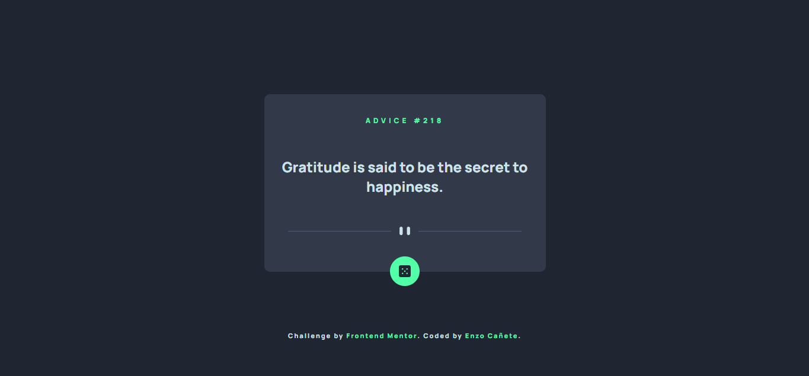

# Frontend Mentor - Advice generator app solution

This is a solution to the [Advice generator app challenge on Frontend Mentor](https://www.frontendmentor.io/challenges/advice-generator-app-QdUG-13db). Frontend Mentor challenges help you improve your coding skills by building realistic projects.

## Table of contents

- [Overview](#overview)
  - [The challenge](#the-challenge)
  - [Screenshot](#screenshot)
  - [Links](#links)
- [My process](#my-process)
  - [Built with](#built-with)
  - [What I learned](#what-i-learned)
  - [Continued development](#continued-development)
  - [Useful resources](#useful-resources)
- [Author](#author)
- [Acknowledgments](#acknowledgments)


## Overview

### The challenge

Users should be able to:

- View the optimal layout for the app depending on their device's screen size
- See hover states for all interactive elements on the page
- Generate a new piece of advice by clicking the dice icon

### Screenshot




### Links

- Solution URL: [Add solution URL here](https://github.com/EnzoDev10/advice-generator/tree/main)
- Live Site URL: [Add live site URL here](https://enzodev10.github.io/advice-generator/)

## My process

### Built with

- Semantic HTML5 markup
- CSS custom properties
- Flexbox
- CSS animations
- Mobile-first workflow
- Vanilla JavaScript


### What I learned

With this project i learned basic JavaScript (To fetch the data from the API), how to make animations with CSS and how to use  emmet to write HTML effectively.

A small snippet of what i did with JS:

```js
 let response = await fetch(apiUrl);
  if (response.ok) {
    let json = await response.json();
    // Gets the content out of the API to a json file.
    let slip = json.slip;

    // Then puts the respective values inside two different variables.
    let id = slip.id;
    let advice = slip.advice;

    document.getElementById("quote-index").innerHTML ="advice #" + id;
    document.getElementById("quote").innerHTML = advice;

  } else {
    // if the API doesn't work, sends an alert.
    alert("something went wrong.");
  }
}
}
```

### Continued development

In future projects i would like to try out one a CSS preprocessor like stylus or sass, they may help me become more effective at my work. I would also like to keep improving my knowledge of JavaScript as i'm only a beginner with the language.

### Useful resources

- [Example resource 1](https://youtu.be/zHUpx90NerM?si=PJNOAITKkac2V5sd) - This helped me to make the animations and transitions.

## Author

- Frontend Mentor - [@yourusername](https://www.frontendmentor.io/profile/EnzoDev10)


## Acknowledgments

I know he will not see this, but i want to show my gratitude to traversy media, without his tutorial about animations i could have not done the animations in this project.
